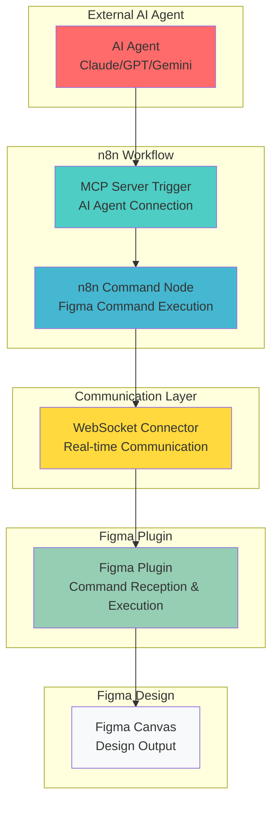
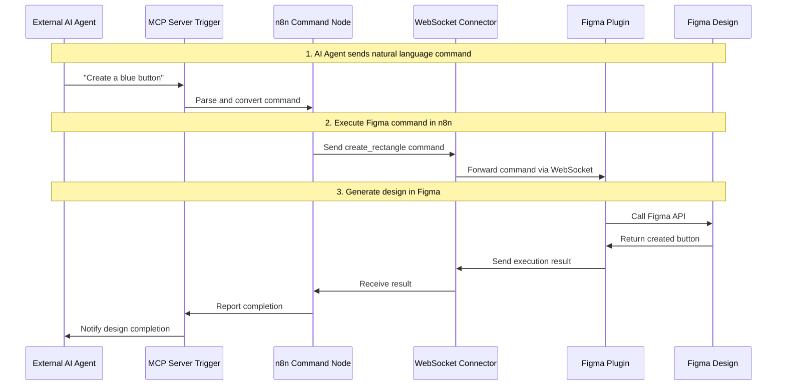
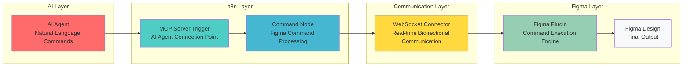

# Figmation - Figma Plugin

A React-based Figma plugin for external automation of Figma design workflows. Connects to n8n workflows via WebSocket server to execute Figma API commands.

## 🎯 Core Architecture



## 🔄 Data Flow



## ⚡ Key Features

- **55+ Figma API Commands Support**: create_rectangle, create_text, move_node, instance management, and more
- **WebSocket Communication**: Real-time connection with n8n workflows
- **Channel-based Isolation**: Multi-channel support for project separation
- **Auto-reconnection**: Automatic recovery with exponential backoff on connection failure
- **Real-time Monitoring**: Display connection status, channel information, and command execution history
- **Dynamic Loading Compatible**: Supports Figma's new dynamic page loading system
- **Component Instance Management**: Get/set instance overrides, detach instances from components
- **Font Search**: Search available fonts with keyword filtering
- **Batch Operations**: Apply styles to multiple nodes simultaneously

## 🏗️ Component Architecture



## Installation and Usage

### Development Environment Setup

```bash
# Install dependencies
npm install

# Development mode (hot reload)
npm run dev

# Production build
npm run build

# Test UI in browser
npm run preview
```

### Install Plugin in Figma

1. Run `npm run build`
2. In Figma, go to Plugins → Development → Import plugin from manifest...
3. Select the `dist/manifest.json` file

### Configuration

The plugin is configured for **localhost-only connections** for enhanced security and stability:

- **Host**: Fixed to `localhost` (cannot be changed)
- **Port**: Configurable (default: 3055)
- **Channel**: Configurable (default: hellofigma)
- **Connection URL**: `ws://localhost:{port}` (no path)

This simplified configuration eliminates external server access issues and ensures reliable local development.

## Architecture

### WebSocket Communication Flow

```
n8n Workflow → WebSocket Server → Figma Plugin → Figma API
```

### Supported Commands (55+)

#### Shape Creation Commands
- `create_rectangle`: Create rectangle with optional corner radius
- `create_ellipse`: Create ellipse with optional arc data
- `create_circle`: Create circle
- `create_line`: Create line
- `create_star`: Create star shape
- `create_polygon`: Create polygon
- `create_vector_path`: Create custom vector path from SVG data

#### Text Commands
- `create_text`: Create text node with font styling
- `update_text`: Update text content and properties
- `set_text_content`: Change text content (alias for update_text)
- `set_font`: Set font properties
- `scan_text_nodes`: Find all text nodes in document
- `set_multiple_text_contents`: Update multiple text nodes at once
- `search_available_fonts`: Search fonts with keyword filtering

#### Frame and Layout Commands
- `create_frame`: Create frame container
- `create_auto_layout`: Create auto-layout frame
- `create_instance`: Create instance from component
- `create_component`: Create component from existing node IDs
- `set_layout_grid`: Apply layout grid
- `set_layout_mode`: Configure auto-layout properties
- `set_padding`: Set padding for auto-layout
- `set_item_spacing`: Set spacing between items

#### UI Component Commands
- `create_button`: Create button component
- `create_input_field`: Create input field component
- `create_checkbox`: Create checkbox component
- `create_toggle`: Create toggle switch component

#### Style Commands
- `set_fill_color`: Set fill color
- `set_stroke_color`: Set stroke color and properties
- `set_opacity`: Set node opacity
- `set_corner_radius`: Set corner radius
- `set_individual_corner_radius`: Set individual corner radii
- `apply_effect`: Apply visual effects

#### Effect Commands
- `add_drop_shadow`: Add drop shadow effect
- `add_inner_shadow`: Add inner shadow effect
- `add_blur`: Add blur effect

#### Selection Commands
- `select_nodes`: Select multiple nodes by IDs
- `select_nodes_by_type`: Select all nodes of specific type
- `select_nodes_by_name`: Select nodes by name pattern

#### Batch Style Commands
- `apply_styles_to_selection`: Apply styles to selected nodes
- `apply_text_styles_to_selection`: Apply text styles to selected text nodes
- `apply_styles_to_nodes`: Apply styles to specific nodes by IDs

#### Instance Management Commands
- `get_instance_overrides`: Get override properties of a component instance
- `set_instance_overrides`: Apply overrides to a component instance (supports TEXT, VARIANT, BOOLEAN, and INSTANCE_SWAP properties)
- `detach_instance`: Detach instance from its main component

#### Information Commands
- `get_document_info`: Get document information
- `get_selection`: Get selected elements information
- `get_node_info`: Get specific node information
- `get_nodes_info`: Get multiple nodes information
- `get_page_info`: Get current page information
- `get_components`: Get list of components with properties
- `search_nodes`: Search nodes by criteria

#### Management Commands
- `delete_node`: Delete single node
- `delete_multiple_nodes`: Delete multiple nodes
- `clone_node`: Clone node
- `export_node_as_image`: Export node as image

#### Boolean Operations
- `boolean_union`: Union operation
- `boolean_subtract`: Subtract operation
- `boolean_intersect`: Intersect operation
- `boolean_exclude`: Exclude operation

#### Other Commands
- `create_image_from_url`: Create image from URL
- `group_nodes`: Group multiple nodes
- `ungroup_node`: Ungroup nodes
- `set_rotation`: Set rotation angle

## Channel System

Each workflow provides isolated communication through unique channels:

1. **Channel Creation**: n8n trigger node creates a named channel
2. **Client Registration**: Plugin connects to a specific channel
3. **Command Routing**: Action specifies channel ID for specific channel
4. **Isolation**: Each channel maintains separate client lists

## Development Guide

### Adding New Commands

1. Add command handler in `src/main.ts`:
```typescript
case 'new_command':
  return await newCommandFunction(params)
```

2. Register command in n8n action node (separate repository)

### Error Handling

- **Connection Failure**: Automatic reconnection with exponential backoff
- **Command Timeout**: 10-second timeout and cleanup
- **Channel Error**: Channel existence and permission validation
- **Figma API Error**: Design mode validation and parameter checking

## Tech Stack

- **Build Tool**: Vite + Plugma Framework
- **UI Framework**: React 18 + TypeScript
- **WebSocket**: Native WebSocket API
- **Figma API**: Official Plugin API types

## License

MIT License

## Developer Information

- **Name**: Dante
- **Company**: Dante Labs
- **Email**: datapod.k@gmail.com
- **Company Homepage**: https://dante-datalab.com
- **YouTube**: https://youtube.com/@dante-labs

## Related Projects

- [n8n-nodes-figmation](https://github.com/dandacompany/n8n-nodes-figmation): n8n custom nodes package

## Acknowledgments

This project was inspired by [Cursor Talk to Figma MCP](https://github.com/sonnylazuardi/cursor-talk-to-figma-mcp) by [@sonnylazuardi](https://github.com/sonnylazuardi). We extend our gratitude for the innovative MCP integration approach that enabled us to create an n8n workflow-compatible version for Figma automation.

Special thanks to the original project for demonstrating the power of Model Context Protocol (MCP) in bridging AI tools with design workflows.
