# Figmation - Figma Plugin

A React-based Figma plugin for external automation of Figma design workflows. Connects to n8n workflows via WebSocket server to execute Figma API commands.

## 🎯 Core Architecture

```mermaid
graph TB
    subgraph "External AI Agent"
        A[AI Agent<br/>Claude/GPT/Gemini]
    end
    
    subgraph "n8n Workflow"
        B[MCP Server Trigger<br/>AI Agent 연결]
        C[n8n Command Node<br/>Figma 명령 실행]
    end
    
    subgraph "Communication Layer"
        D[WebSocket Connector<br/>실시간 통신]
    end
    
    subgraph "Figma Plugin"
        E[Figma Plugin<br/>명령 수신 및 실행]
    end
    
    subgraph "Figma Design"
        F[Figma Canvas<br/>디자인 결과물]
    end
    
    A --> B
    B --> C
    C --> D
    D --> E
    E --> F
    
    style A fill:#ff6b6b
    style B fill:#4ecdc4
    style C fill:#45b7d1
    style D fill:#ffd93d
    style E fill:#96ceb4
    style F fill:#f8f9fa
```



## 🔄 Data Flow


## ⚡ Key Features

- **36 Figma API Commands Support**: create_rectangle, create_text, move_node, and more
- **WebSocket Communication**: Real-time connection with n8n workflows
- **Channel-based Isolation**: Multi-channel support for project separation
- **Auto-reconnection**: Automatic recovery with exponential backoff on connection failure
- **Real-time Monitoring**: Display connection status, channel information, and command execution history
- **Dynamic Loading Compatible**: Supports Figma's new dynamic page loading system

## 🏗️ Component Architecture


## Installation and Usage

### Development Environment Setup

```bash
# Install dependencies
npm install

# Development mode (hot reload)
npm run dev

# Production build
npm run build

# Test UI in browser
npm run preview
```

### Install Plugin in Figma

1. Run `npm run build`
2. In Figma, go to Plugins → Development → Import plugin from manifest...
3. Select the `dist/manifest.json` file

### Configuration

The plugin is configured for **localhost-only connections** for enhanced security and stability:

- **Host**: Fixed to `localhost` (cannot be changed)
- **Port**: Configurable (default: 3055)
- **Channel**: Configurable (default: hellofigma)
- **Connection URL**: `ws://localhost:{port}` (no path)

This simplified configuration eliminates external server access issues and ensures reliable local development.

## Architecture

### WebSocket Communication Flow

```
n8n Workflow → WebSocket Server → Figma Plugin → Figma API
```

### Supported Commands

#### Creation Commands
- `create_rectangle`: Create rectangle
- `create_frame`: Create frame
- `create_text`: Create text
- `create_circle`: Create circle
- `create_line`: Create line

#### Manipulation Commands
- `move_node`: Move node
- `resize_node`: Resize node
- `set_fill_color`: Set fill color
- `set_stroke_color`: Set stroke color
- `set_text_content`: Change text content

#### Information Commands
- `get_document_info`: Get document information
- `get_selection`: Get selected elements information
- `get_node_info`: Get specific node information

#### Management Commands
- `delete_node`: Delete node
- `clone_node`: Clone node
- `export_node_as_image`: Export node as image

## Channel System

Each workflow provides isolated communication through unique channels:

1. **Channel Creation**: n8n trigger node creates a named channel
2. **Client Registration**: Plugin connects to a specific channel
3. **Command Routing**: Action specifies channel ID for specific channel
4. **Isolation**: Each channel maintains separate client lists

## Development Guide

### Adding New Commands

1. Add command handler in `src/main.ts`:
```typescript
case 'new_command':
  return await newCommandFunction(params)
```

2. Register command in n8n action node (separate repository)

### Error Handling

- **Connection Failure**: Automatic reconnection with exponential backoff
- **Command Timeout**: 10-second timeout and cleanup
- **Channel Error**: Channel existence and permission validation
- **Figma API Error**: Design mode validation and parameter checking

## Tech Stack

- **Build Tool**: Vite + Plugma Framework
- **UI Framework**: React 18 + TypeScript
- **WebSocket**: Native WebSocket API
- **Figma API**: Official Plugin API types

## License

MIT License

## Developer Information

- **Name**: Dante
- **Company**: Dante Labs
- **Email**: datapod.k@gmail.com
- **Company Homepage**: https://dante-datalab.com
- **YouTube**: https://youtube.com/@dante-labs

## Related Projects

- [n8n-nodes-figmation](https://github.com/dandacompany/n8n-nodes-figmation): n8n custom nodes package

## Acknowledgments

This project was inspired by [Cursor Talk to Figma MCP](https://github.com/sonnylazuardi/cursor-talk-to-figma-mcp) by [@sonnylazuardi](https://github.com/sonnylazuardi). We extend our gratitude for the innovative MCP integration approach that enabled us to create an n8n workflow-compatible version for Figma automation.

Special thanks to the original project for demonstrating the power of Model Context Protocol (MCP) in bridging AI tools with design workflows.
